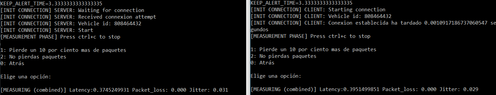

# Q4S_lite
Implementación de la pila q4s para remote driver
Este proyecto incluye dos modos de uso:
- Q4S_lite standalone: Implementación standar del protocolo q4s_lite
- Q4S_lite como librería: Se instancia q4s desde los modulos de actuación y pulicación

# Q4S_lite standalone
## Fichero ejecutable
- q4s_lite.py
## Requisitos:
  >python3.10
## Configuración:
En el codigo fuente se tienen que modificar los siguientes parámetros
- server_address, server_port: Direccion y puerto del nodo servidor separados por coma. 
- client_address, client_port: Direccion y puerto del nodo cliente separados por coma.
- Otros parametros configurables:
 - VEHICLE_ID: Id del vehículo (**Se obtendrá de un fichero**)
 - LATENCY_ALERT: Valor en milisegundos para producir alertas por latencia
 - PACKET_LOSS_ALERT: Valor en tanto por 1 para producur alertas por pérdida de paquetes
## Uso:
- Start:
  
  `>py q4s_lite.py [-c|-s]`
  
  -c para modo cliente
  
  -s para modo servidor
  
  Una vez arrancado, cada extremo de la pila espera 15 segundos al otro extremo
- Stop:
  Pulsar 0 o ctrl+c
- Interpretación de lo que se ve:
  
  

  El formato de los mensajes es de la siguiente manera:

  [Estado] Mensaje

  | **Server**          | **Client**          |
  |-----------------|-----------------|
  | Inicio sesión   | Inicio sesión   |
  | Menú perdidas   | Menú perdidas   |
  | Medición actual | Medición actual |
  

# Q4S_lite como librería
## Ficheros ejecutables
- actuator.py
- publicator_mqtt.py (con el fichero auxiliar password.txt)

## Requisitos:
  >python3.10

  >paho (se instala con pip install paho-mqtt)
## Configuración:
En el codigo fuente de q4s_lite (q4s_lite.py) se tienen que modificar los siguientes parámetros
- server_address, server_port: Direccion y puerto del nodo servidor separados por coma. 
- client_address, client_port: Direccion y puerto del nodo cliente separados por coma.
- Otros parametros configurables:
 - VEHICLE_ID: Id del vehículo (**Se obtendrá de un fichero**)
 - LATENCY_ALERT: Valor en milisegundos para producir alertas por latencia
 - PACKET_LOSS_ALERT: Valor en tanto por 1 para producur alertas por pérdida de paquetes
## Uso actuador:
- Start:

  `>actuator.py`
- Stop:
  Pulsar 0 o ctrl+c
- Interpretación de lo que se ve:

## Uso publicador:
- Start:

`>publicator.py`
Requiere el fichero password.txt para conectarse con el servidor mqtt de upm
- Stop:
  Pulsar 0 o ctrl+c
- Interpretación de lo que se ve:
